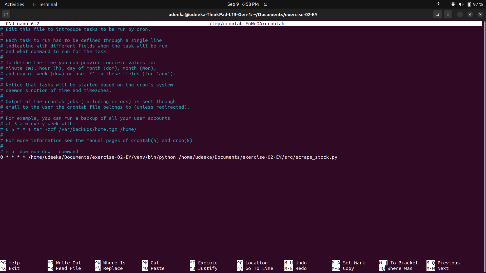

# Stock Price Monitoring and Email Alerts

## Overview

This project is a Python-based automation tool that tracks the stock price of Apple Inc. (AAPL) by scraping data from Yahoo Finance. It compares the latest scraped price with historical data stored in a CSV file, calculates the price difference and percentage change, and sends an email alert if the price difference exceeds a specified threshold. The script is designed to run periodically, with scheduling handled by cron jobs or Task Scheduler.

## Features

- **Web Scraping**: Scrapes the current stock price of Apple (AAPL) from Yahoo Finance.
- **Data Reconciliation**: Compares the newly scraped stock price with the latest value stored in `stock_data.csv` file.
- **Price Difference Calculation**: Computes both the absolute difference and percentage change between the current price and the previous price.
- **Email Notification**: Sends an email alert if the price difference exceeds a predefined threshold.
- **Scheduling**: The script is set up to run periodically using cron jobs (Linux/macOS) or Task Scheduler (Windows).

## Prerequisites

Before running the script, ensure you have the following installed:

- Python 3.x
- The following Python libraries:
   - `requests`
   - `beautifulsoup4`
   - `pandas`
   - `smtplib`
   - `re`
   - `email` (part of Python's standard library)

## Project Structure

```bash
.
├── README.md
├── stock_data.csv          # Contains historical stock price data
├── src
│   ├── scrape_stock.py     # Contains the web scraping logic
│   ├── compare_prices.py   # Contains the logic for comparing stock prices
├── main.py                 # Main execution file
└── env.py                  # Stores sensitive information like SMTP credentials
```

### `stock_data.csv`
This file contains historical stock price data in the following format:

| Company | Price   |
|---------|---------|
| META    | 330.26  |
| AAPL    | 190.25  |
| AMZN    | 142.66  |
| TSLA    | 232.00  |

You can append new rows to this CSV as needed.

### `env.py`
This file should contain the following variables:

```python
SMTP_SERVER = 'Your SMTP server (e.g., smtp.gmail.com)'
SMTP_PORT = 587  # SMTP port (e.g., 587 for TLS)
SENDER_EMAIL = 'Your sender email'
RECEIVER_EMAIL = 'Your recipient email'
EMAIL_PASSWORD = 'Your email password'
```

## Usage

### Step 1: Web Scraping

The stock price is scraped from Yahoo Finance using the `BeautifulSoup` library.

1. The target URL for Apple Inc. stock data is:  
   [https://finance.yahoo.com/quote/AAPL?p=AAPL](https://finance.yahoo.com/quote/AAPL?p=AAPL)

2. The stock price is extracted from the HTML response using the following code:

```python
import requests
from bs4 import BeautifulSoup

url = 'https://finance.yahoo.com/quote/AAPL?p=AAPL'
response = requests.get(url)
html_content = response.text

soup = BeautifulSoup(html_content, 'html.parser')
price_element = soup.find('fin-streamer', {'data-field': 'regularMarketPrice'})
price = float(price_element.text)
```

### Step 2: Data Reconciliation

The script reads `stock_data.csv` and filters data for Apple (AAPL). It compares the scraped price with the latest historical value, calculates the price difference, and percentage change:

```python
df = pd.read_csv('stock_data.csv')
apple_data = df[df['Company'] == 'AAPL']
last_price = apple_data['Price'].iloc[-1] if not apple_data.empty else None
```

### Step 3: Sending Email Alerts

If the price difference exceeds a threshold (you can modify this in the code), the script sends an email alert with the following content:

- Current stock price
- Price difference (absolute and percentage)
- Threshold comparison (up or down)

The `smtplib` library is used to send emails via Gmail SMTP. You need to ensure **Less Secure Apps** is enabled in Gmail settings.

```python
import smtplib
from email.mime.text import MIMEText
from email.mime.multipart import MIMEMultipart

msg = MIMEMultipart()
msg['From'] = SENDER_EMAIL
msg['To'] = RECEIVER_EMAIL
msg['Subject'] = 'Apple Stock Price Alert'

body = f'Current Apple stock price: ${price}\nPrice difference: ${price_diff}'
msg.attach(MIMEText(body, 'plain'))

with smtplib.SMTP(SMTP_SERVER, SMTP_PORT) as server:
    server.starttls()
    server.login(SENDER_EMAIL, EMAIL_PASSWORD)
    server.sendmail(SENDER_EMAIL, RECEIVER_EMAIL, msg.as_string())
```

### Step 4: Scheduling the Script

To run the script periodically, set up a cron job (Linux/macOS) or a Task Scheduler task (Windows).

#### Crontab Setup

This setup ensures that the `scrape_stock.py` script runs every hour.

##### Crontab Example:

```bash
0 * * * * /usr/local/bin/python3 /home/username/projects/stock-price-monitor/src/scrape_stock.py
```

- The cron job is scheduled to run at the start of every hour (`0 * * * *`).
- The path `/usr/local/bin/python3` points to the Python interpreter in your system.
- The path `/home/username/projects/stock-price-monitor/src/scrape_stock.py` is the example path to the Python script in your project directory.

Ensure that you update the path to match your environment.

##### Crontab Screenshot:



#### Example for Task Scheduler (Windows):
1. Open Task Scheduler.
2. Create a new task.
3. Set the trigger to run the task every hour.
4. Set the action to run Python with the path to `main.py`.

## License

This project is licensed under the MIT License. See the `LICENSE` file for more details.

## Contributions

Feel free to fork this repository, open issues, or submit pull requests.
